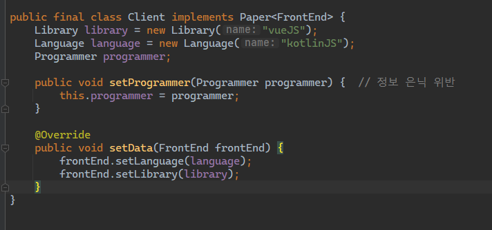

## 코드스피츠 오브젝트 해설 강의 챕터 4 LSP OCP 정리

비즈니스 도메인 설명
- 프로그래머는 프론트엔드와 백엔드로만 구성
- Paper(요구사항정의서)는 Client(FrontEnd)와 ServerClient(FrontEnd, BackEnd)로 구성
- Director(프로젝트 PM)가 프로젝트를 추가하고 프로젝트를 최종적으로 관리 및 실행

### 객체 설계 (Before)

- 아래는 LSP, OCP를 위반하는 설계를 나타낸다.

### 객체 설계 (Working in Progress)

FrontEnd, BackEnd에 Tell, Don't Ask를 적용하여 LSP와 OCP를 위반하는 코드를 변경.

Tell, Don't Ask를 적용했으나, setData() 중복이 발생 DRY(Don't Repeat Yourself) 원칙 위반.

BackEnd, FrontEnd 별로 만드는 프로그램이 다르고, 저런 구조라면 훅 메서드를 사용한 템플릿 메서드 패턴을 적용하는 시각이 보여야 함.

따라서 다음과 같은 Programmer 인터페이스를 추상 클래스로 바꾸고 템플릿 메서드 패턴을 적용해야함. 이 과정이 자연스럽게
이해 되고 바로바로 바꿀 수 있어야 함.

Before

After

Tell, Don't Ask를 적용했으나, Paper의 구현 클래스인 Client, ServerClient에서 여전히 LSP, OCP를 위반하고 있다.

이전에는 Programmer가 Paper를 의존하도록 되어있었고, Programmer의 구현 클래스 BackEnd와 FrontEnd에서 1개의 Paper에 대해 다운 캐스팅을 했지만,
Paper가 Programmer를 의존하도록 의존성을 역전시켜버렸을 때 1:N 관계가 성립됨에 따라, Paper의 각 구현 클래스에서는 N개의 Programmer를 다운 캐스팅하는 최악이 발생함.

그럼 어떻게 이 문제를 해결할까? 답은 Generics.

Generics를 적용해서, Paper의 구현 클래스인 Client에서 형을 확정지을 수 있다. 따라서 런타임에 형을 확정 짓는 것이 아닌,
컴파일 타임에 형을 확정지어야 한다. 형을 확정 짓고 Client 클래스를 사용하는 책임은 전적으로 클라이언트 사용자에게 위임된다.

Generics가 해주는 것은 instanceof를 제거해주는 역할까지만. 

하지만 또 문제, ServerClient는 어떻게..? BackEnd, FrontEnd 두 개가 필요한데?

해결 방법으로 Generics의 T, R로 구분할 수 있지만, 3개일 경우? 4개일 경우? 개수만큼 Generics 타입을 넣어줘야 하나?

Generics 타입을 넣어줄 때마다 코드가 컴파일 타임에 깨진다.

N개의 Programmer를 대응하는 Paper 쪽에서 제네릭을 적용할 경우 더욱 변경이 어렵고 무거워진다.

현실 세계의 객체 바인딩은 1:1로만 이루어지지 않는다. 1:N, N:N으로 이루어진다.

## 객체 설계 (Finally)

Paper를 다시 마커 인터페이스로 변경하고, 다음과 같이 Programmer에 Generics를 적용한다.

그럼 이제, 클라이언트인 Director에서 어떻게 바뀔까?

Before

After

범용적인 FrontEnd, BackEnd가 아닌 형을 확정 짓는 FrontEnd, BackEnd로 변경.

이로써, Programmer라는 추상 레이어보다 하위 클래스인 FrontEnd, BackEnd까지로 형을 확정짓는 것을
밀어냈다. 따라서 새로운 경우의 수가 추가되어도 클래스만 추가하면 변경엔 닫혀있고 확장엔 열려있는 구조가 나온다.

OCP 위반을 막아내려면, 최대한 클라이언트 사용자 쪽으로 경우의 수를 밀어버려야 한다. 이 말의 의미는 클라이언트에서 클래스를 더 추가하고 정의하는 곳인 Main 메서드까지 
경우의 수를 밀어내야 한다.

최종적으로 Paper는 다음과 같은 구조로 변경된다.

구현 클래스는 다음과 같이 변경된다.

가장 추상적인 메소드인 Paper의 Program[] run()을 클라이언트 사용자로 넘겨야 하기 때문에,
다음과 같이 Client와 ServerClient는 더 이상 완전한 요구사항 정의서라는 도메인의 역할을 수행할 수 없다.

왜냐하면 Director가 여러 Director가 있을 수 있고, Programmer도 다양해질 수 있기 때문에, 수행하는 방법이 바뀐다.
그러므로 수행하는 방법(경우의 수)이 다양해지는 만큼 형(Type)을 만들어야 한다. 대신, Client와 ServerClient의 속성은 그대로 가져간다.

Director는 아래와 같이 변경된다.

마지막으로, 모든 클래스를 사용하는 최종 클라이언트인 main 메소드는 다음과 같다.

main 메소드까지 모든 경우의 수를 밀어냈기 때문에, DI가 가능한 구조가 나오게 된다.

